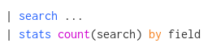
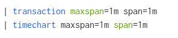

SPL Parser
==========

The goal of this project is to provide a Python tool that would dynamically generate a TextMate grammar from the description of Splunk's Search Processing Language (SPL) syntax. The generated grammar could be then used by text editors to provide syntax highlighting for SPL.

Motivation
----------

Splunk is a software platform to search, analyze, and visualize machine-generated data (typically logs). To do this, Splunk uses its Search Processing Language (SPL). SPL provides over 140 commands that allow to search and work with the data. The commands can have different parameters and can use different functions, which is described in Splunk https://docs.splunk.com/Documentation/Splunk/8.0.0/SearchReference/WhatsInThisManual[Search Reference].

While working with Splunk, you can come up with a useful SPL query. As the queries can be quite complex, you might want to save the query to a text file for future use. 

An SPL query may look like this:

[source]
----
index=_internal sourcetype=scheduler result_count 
| extract pairdelim=",", kvdelim="=", auto=f 
| stats avg(result_count) min(result_count) max(result_count), sparkline avg(run_time) min(run_time) max(run_time) sum(run_time) values(host) AS hosts countAS execution_count by savedsearch_name, app 
| join savedsearch_name type=outer 
 [| rest /servicesNS/-/-/saved/searches 
 | fields title eai:acl.owner cron_schedule dispatch.earliest_time dispatch.latest_time search 
 | rename title AS savedsearch_name eai:acl.app AS App eai:acl.owner AS Owner cron_schedule AS "Cron Schedule" dispatch.earliest_time AS "DispatchEarliest Time" dispatch.latest_time AS "Dispatch Latest Time"] 
| rename savedsearch_name AS "Saved Search Name" search AS "SPL Query" app AS App 
| makemv delim="," values(host) 
| sort - avg(run_time) 
| table "Saved Search Name", App, Owner, "SPL Query", "Dispatch Earliest Time" "Dispatch Latest Time" "Cron Schedule" hosts, execution_count, sparkline, * (result_count), sum(run_time) *(run_time)
----

But the same query looks like this while written in the Splunk web interface:

image::examples/SPL_query.png[]

It is visible that syntax highlighting makes the query much easier to read and understand. One may quickly become lost while editing a text file containing multiple complex SPL queries.

It would be good to have syntax highlighting for SPL available also in a text editor. However, there is currently no support for SPL in commonly used text editors, and there are no plugins available that would add this feature.

Background
----------

TextMate Grammars
~~~~~~~~~~~~~~~~~

https://macromates.com/manual/en/language_grammars[TextMate] language grammars are used to assign names to document elements such as keywords, comments, strings, or similar. The purpose of this is to allow styling (syntax highlighting) in a text editor. The grammar is defined as a set of language rules. The language rule is a regular expression that is matched against a line in the document.

Multiple popular text editors support TextMate grammars:

* TextMate
* Visual Studio Code
* Sublime Text
* Atom
* and others

SPL Syntax
~~~~~~~~~~

The description of SPL syntax can be retrieved in the following ways:

* online Splunk https://docs.splunk.com/Documentation/Splunk/8.0.0/SearchReference/WhatsInThisManual[documentation] (not intended to be machine-readable)
* link:examples/searchbnf.conf[searchbnf.conf] file that is located in the folder on a Splunk server (such as `$SPLUNK_HOME/etc/system/default/`)
* via Splunk REST API, making requests towards a Splunk server running remotely or locally (an output of such request for all commands may look like link:examples/searchbnf.json[this])

The last two options contain a description of SPL written in a "Pseudo-BNF" form. "Pseudo" means that the syntax description might not be parsable by available https://en.wikipedia.org/wiki/Backus%E2%80%93Naur_form[BNF] parsers. These descriptions also contain other useful information apart from the commands' syntax, for example, permissions for the commands, or their documentation.

The functionality of Splunk can be extended by Splunk Apps or Add-ons. This concept is commonly used, users may download an app from https://splunkbase.splunk.com/[Splunkbase] or develop their own custom app (which is often happening, as it is not a difficult task). Apps or add-ons may provide (and they often do) their own SPL commands and functions.

The last two syntax description options should be somehow consistent (from the perspective of the syntax itself). However, there might be some differences - e.g., some applications may not expose their commands via REST API, but it may have a _searchbnf.conf_ file, or vice versa.

Remarks
-------

It may seem that this project would be single-purpose, and there would be no need to use it again once the grammar is generated. However, there are several scenarios in which the grammar could be re-generated:

. SPL is still evolving and the commands and keywords change with different versions of Splunk
. a user may want to generate grammar specific for himself, which would filter out commands that the user won't have permission to execute (and he would be able to observe this fact while editing the searches in a text editor)
. an enterprise using Splunk typically has tens of apps installed on the Splunk server (some of which may be custom) - it makes sense to generate a grammar specific to that environment. Such grammar would recognize all the commands and keywords defined by the apps in addition to the basic set provided by Splunk

''''

This project aims to make the syntax highlighting a little bit intelligent. Consider the following examples:

[.left]

[.left]

In the first example, the word _search_ is highlighted in the first line, as it is the name of the command. However, in the second line, it is the name of a field, and thus not highlighted.

In the second example, _maxspan_ is highlighted in the first line, as it is a parameter of _transaction_ command. However, it is not highlighted in the second line, as it is not a parameter of _timechart_ command. The same happens with the _span_ parameter in the opposite direction.

To cover similar cases, it is necessary to include a list of possible parameters and functions to the grammar rules for every command. As the number of commands is quite high, it makes sense to generate the grammar automatically.

'''

The syntax definition for SPL commands may be simple, but also quite complex, as may be seen from the following examples:

Syntax description for _abstract_ command:
[source]
----
"abstract (maxterms=<int>)? (maxlines=<int>)?"
----

Syntax description for _eval_ command:
[source]
----
"eval <eval-field>=<eval-expression> (\",\" <eval-field>=<eval-expression>)*"
----

Where each term enclosed in `<>` has its own syntax description:
[source]
----
<eval-expression>: "<eval-math-exp> | <eval-concat-exp> | <eval-compare-exp> | <eval-bool-exp> | <eval-function-call>"
<eval-math-exp>: "(<field>|<num>) ((+|-|*|/|%) <eval-expression>)*"
----

As visible, the terms may be even nested into each other. This situation needs to be detected and handled accordingly.

'''

Both link:examples/searchbnf.conf[searchbnf.conf] and link:examples/searchbnf.json[JSON] representations of all commands are very long and difficult to manipulate. Fortunately, the REST endpoint allows making requests for a particular link:examples/stats-command.json[term], which simplifies the response messages and the parsing process. Therefore, it makes sense to send requests for multiple terms while parsing syntax for a complex command.

Features
--------

The primary function of SPL parser is to automatically generate a correct TextMate grammar usable for syntax highlighting of SPL in a text editor.

The implementation should cover the following functionalities and technologies:

* it should provide CLI interface (by using _Click_)
* it should get the SPL syntax definition from a remote or local Splunk server - a user provides a URL (by using _Requests_)
* it should use an appropriate storage method for storing already received syntax terms and should not make duplicate requests
* if the syntax definition for a command contains multiple terms, requests for these terms should be made concurrently (by using _AsyncIO_)
* the tool should be able to use also link:examples/searchbnf.conf[searchbnf.conf] (by using _configparser_) or a local JSON file as a fallback option - these files could be provided via a CLI option
* the CLI should allow making a request for a particular command or term - to view information such as permissions or documentation for the command. This may serve as a point for possible extension in the future (providing interactive help in a text editor, providing web interface with the command details, ...)
* the parser should be built as a Python package and tested accordingly (by using _pytest_ and _betamax_ for testing the communication)
* the generated grammar should cover at least some of the edge cases described in the examples above
* it should be possible to use the generated output for syntax highlighting in a text editor - this should be proved by providing an extension/plugin/package for at least one text editor which would use the generated grammar
